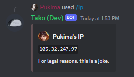

import { Tabs, TabItem } from '@astrojs/starlight/components';
import Badge from '@astrojs/starlight/components/Badge.astro';

With `/ip`, you can show (a fake) IP Adress of an user, including yourself.

## Usage

<Tabs>
	<TabItem label="Context Menu">`/ip [user]`</TabItem>
</Tabs>

## Options

<Tabs>
	<TabItem label="User">
		<Badge text="Optional" />
		The user you want to show the IP Adress of. This is yourself if not specified. The default is yourself.
	</TabItem>
</Tabs>

## Output

