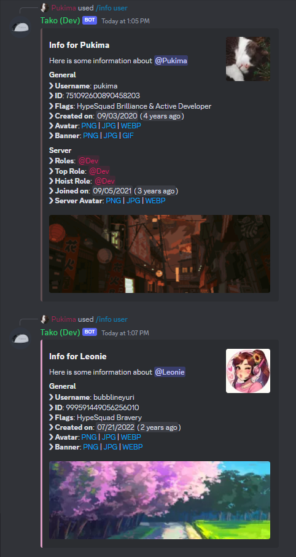

import { Tabs, TabItem } from '@astrojs/starlight/components';

With `/info user`, you can get information about a user on Discord. This is useful to get all the important info at a glance, especially when mentions you got sent, are broken (similar looking to `<@751092600890458203>`).

## Usage

<Tabs>
	<TabItem label="Slash Commands">
		`/info user [user]`
	</TabItem>
	<TabItem label="Context Menu">
		[*User Context Menu*](../../../reference/context-menus/#user-context-menu) > *Apps* > *User Info*
	</TabItem>
</Tabs>

## Output

This command will show you an embed with the most relevant infos. It also includes a customizable banner and color.

If the user is in the same server, the command got executed in, it will also show additional information regarding the member on the server.

{/* The color will be picked as followed: _User Color (`/set_color personal`)_ > _Profile Color_ > _Server Color (`/set_color server`)_ > Default Color (turquoise) */}
The color will be picked as followed: _Profile Color_ > Default Color (turquoise)

The Server Avatar will also be shown, if it's different than the regular avatar, as well as a GIF Link, if the Avatar is animated.

_Top shows the view, if the person is on the server (with overwritten server avatar), while the bottom one is the info every user has_
