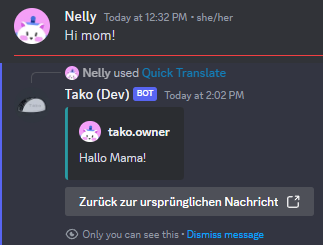

import { Tabs, TabItem } from '@astrojs/starlight/components';

With `/set-language`, you can customize the language used in Tako's responses and automatic translation.

## Usage

<Tabs>
	<TabItem label="Context Menu">
		[*Message Context Menu*](../../../reference/context-menus/#message-context-menu) > *Apps* > *Quick Translate*
	</TabItem>
</Tabs>

:::note
This command uses your personal language setting, that you can define with the [`/set-language personal`](../set-language) command.
:::

## Output

Example output with the personal language set to `de` (German).

This command will show you a translated version of the message you ran the command on. The translation will be in the language you have set with the [`/set-language personal`](../set-language) command.
It can translate messages into any language, as long as it is supported by Google Translate.
