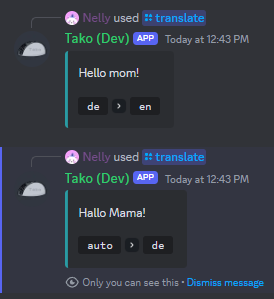

import { Tabs, TabItem } from '@astrojs/starlight/components';
import Badge from '@astrojs/starlight/components/Badge.astro';

With `/translate`, you can easily translate any text all within Discord.

## Usage

<Tabs>
	<TabItem label="Slash Commands">
        `/translate <text> [language] [source] [ephemeral]`
    </TabItem>
	<TabItem label="Context Menu">
		Take a look at [Quick Translate](../quick-translate), if you want to translate messages using the [Message Context Menu](../../../reference/context-menus/#message-context-menu).
	</TabItem>
</Tabs>

## Options

<Tabs>
	<TabItem label="Text">The text to translate</TabItem>
	<TabItem label="Source">
		The source language of the text. If not specified, the app will try to automatically detect the language of the
		text.
	</TabItem>
	<TabItem label="Language">
		<Badge text="Default: Dependens on the 'ephemeral' option" />
		The language to translate the text to. If not specified, the app will use either the server language or the personal
		language setting, depending on the ephemeral option.
:::note
The default language is dependent on the `ephemeral` option. If set to `true`, the personal language setting will be used, otherwise the server language is being used.

Wanna know more about language settings? Check out the [Set Language](../set-language) page!
:::
	</TabItem>
	<TabItem label="Ephemeral">
		<Badge text="Default: false	" />
		Whether the response should be ephemeral or not.
:::note
This also affects the language used for translation! If set to `true`,
the personal language setting will be used.
:::
	</TabItem>
</Tabs>

## Output

