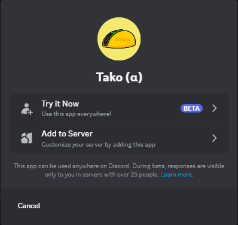

import { Steps } from '@astrojs/starlight/components';

:::caution
User Installable Apps are currently in Preview and have limited functionality. Read the [Limitations](#limitations) section for more information!
:::

## How to Install Tako everywhere

<Steps>

1. Open [Tako's Install Link](https://discord.com/oauth2/authorize?client_id=959798351753252905)
2. You will now be prompted on where you want to install Tako. Select "_Try it Now_" to use it everywhere!
   
3. Now you can use Tako in any server you are in! Just type `/` to see all the commands available to you.
</Steps>

:::tip
For some mobile users there is a Shapes Button in the bottom left corner of the screen that you can tap to open a command center. It then provides an interface for selecting preset commands for the app without having to type them out.

:::

## Limitations

- External Emojis are not supported, so you will see something like `:checkmark:` instead of the actual emoji.
- Discord doesn't provide access to the server, so we will not be able to give you server-specific information.
- During the preview, interaction responses for the user installation context will be forced to be ephemeral in servers with over 25 members.
